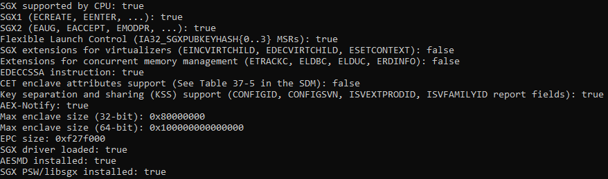
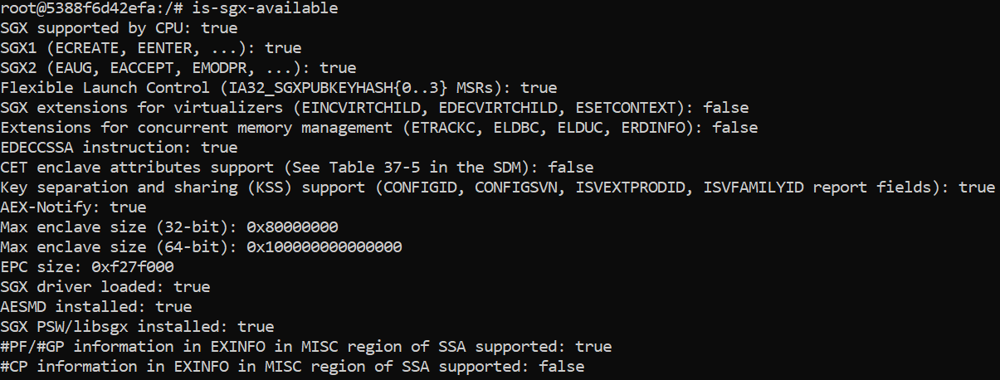

# Tutorial

 This is a tutorial on how to get the ra-tls-mbedtls with DCAP attestation example to work in the Gramine minimal docker [image](https://hub.docker.com/r/gramineproject/gramine). I found no clear/complete documentation on how to get the entire ra-tls-mbedtls (with attestation enabled) example to run. So I documented the steps here. The high-level installations steps are:

1- Installing the libraries required for gramine to run: One example of those libraries is pkg-config. When trying to use mbedtls while compiling the ra-tls-mbedtls example throws the error: 

```bash
src/server.c:14:10: fatal error: mbedtls/build_info.h: No such file or directory
14 | #include "mbedtls/build_info.h"
|          ^~~~~~~~~~~~~~~~~~~~~~
compilation terminated.
make: *** [Makefile:45: server] Error 1
```

I initially thought I had to install mbedtls, however it was actually the pkg-config library that was missing from the docker image. Of course, if I was more familiar with the system I would have found this out instantly, but I actually went and compiled mbedtls from scratch in the container before realizing my mistake and the missing dependencies.  

2- Gramine with DCAP attestation installed. The ra-tls-mbedtls example requires the libraries `ra_tls_attest.so` for server and `ra_tls_verify_dcap.so` for client which are not installed by default in the gramine docker image as of 08/09/2025. The following error arises when running the client app with the `dcap` flag.

```bash
libra_tls_verify_dcap.so: cannot open shared object file: No such file or directory
User requested RA-TLS verification with DCAP but cannot find lib
```

3- Install and configure the Intel PCCS service. Without this library the error `sgx_qv_verify_quote failed` pops up at the client when running RA-TLS. 

The Gramine docker [page](https://hub.docker.com/r/gramineproject/gramine) references the Intel documentation for installing, however they reference an outdated version of the Intel documentation for attestation on the local machine. The updated version can be found [here](https://download.01.org/intel-sgx/latest/linux-latest/docs/Intel_SGX_SW_Installation_Guide_for_Linux.pdf) (Last update was on May 2025 when writing this tutorial). However, even with this updated version, **the installation instructions provided there don’t work in docker**. The following error is displayed when running the command `apt-get install sgx-dcap-pccs`.

```bash
Unsupported platform - neither systemctl nor initctl was found.
dpkg: error processing package sgx-dcap-pccs (--configure):
 installed sgx-dcap-pccs package post-installation script subprocess returned error exit status 5
Processing triggers for libc-bin (2.39-0ubuntu8.5) ...
Errors were encountered while processing:
 sgx-dcap-pccs
E: Sub-process /usr/bin/dpkg returned an error code (1)
```

To get the Intel PCCS service to work in docker, the service needs to be built from source.

Note: there might be easier/smarter ways to solve these issues that I faced, but these are the steps that worked for me. I am merely creating this tutorial in the off chance that it can save others some time. 

## Prerequisites

This tutorial assumes the gramine docker container is running on a system with Intel SGX setup and that the devices `/dev/sgx_enclave` and `/dev/sgx_provision` are passed to docker. As stated [here](https://hub.docker.com/r/gramineproject/gramine). This is an example output of the machine I ran the Gramine image on.

This is the result of `is-sgx-available` command provided by Gramine on the host machine. DCAP attestation requires Flexible Launch Control to be enabled. 



## 1- Start the docker container and install libraries

You might need sudo to access the `sgx_enclave` and `sgx_provision` devices. 

```bash
docker run --device /dev/sgx_enclave --device /dev/sgx_provision -it gramineproject/gramine
```

This is the result of `is-sgx-available` command inside the docker container:



### Installing dependencies

```bash
apt update
apt upgrade
apt-get install pkg-config git build-essential nano wget lsof
apt-get purge gramine
```

Since the installed Gramine library does not come with the required `ra_tls_verify_dcap.so` library, I had to uninstall the already installed Gramine library and build Gramine from source with the `-Ddcap` option enabled. 

## 2- Building Gramine from source

Install required dependencies if they’re not already there

```bash
apt-get install -y cmake libprotobuf-c-dev protobuf-c-compiler protobuf-compiler python3-cryptography python3-pip python3-protobuf

apt-get install -y autoconf bison gawk meson nasm python3 python3-click python3-jinja2 python3-pyelftools python3-tomli python3-tomli-w python3-voluptuous

apt-get install -y libsgx-dcap-quote-verify-dev
```

Clone the Gramine repository. Here the latest Gramine version is 1.9. 

```bash
git clone --depth 1 --branch v1.9 https://github.com/gramineproject/gramine.git
```

```bash
cd gramine
meson setup build/ --buildtype=release -Ddirect=enabled -Dsgx=enabled -Ddcap=enabled
meson compile -C build/
meson install -C build
ldconfig
```

NOTE: sometimes downloading glibc takes time when downloading from source: `Downloading glibc-2.40-1 source from [https://ftp.gnu.org/gnu/glibc/glibc-2.40.tar.gz](https://ftp.gnu.org/gnu/glibc/glibc-2.40.tar.gz)`  

I usually change the `source_url` value in `gramine/subprojects/glibc-2.40-1.wrap` to the value of `source_fallback_url` and run the setup step again. Of course the version of glibc might change depending on which Gramine version you are building. 

Next prepare the signing key by running the following command:

```bash
gramine-sgx-gen-private-key
```

## 3- Install Intel PCCS service on local machine

I got this part to work based on [intel/SGXDataCenterAttestationPrimitives](https://github.com/intel/SGXDataCenterAttestationPrimitives/tree/main) repository. Especially from the [instructions](https://github.com/intel/SGXDataCenterAttestationPrimitives/tree/main/QuoteGeneration/pccs/container) and Dockerfile on building the PCCS service in a container.

Install DCAP related libraries

```bash
apt-get install libsgx-quote-ex libsgx-dcap-ql libsgx-dcap-default-qpl
```

Since it is a local configuration, we need to set the “USE_SECURE_CERT”=FALSE in `/etc/sgx_default_qcnl.conf` 

```bash
nano /etc/sgx_default_qcnl.conf
```

Install dependencies

```bash
apt-get install -yq --no-install-recommends ca-certificates curl gnupg zip
apt-get install nodejs npm libssl-dev

```

Clone the repo, currently DCAP version 1.23 is the latest

```bash
cd /

git clone --recurse-submodules https://github.com/intel/SGXDataCenterAttestationPrimitives.git -b DCAP_1.23 --depth 1
```

Build libPCKCertSelection library, only the debug version worked for me after installing libss-dev. 

```bash
cd /SGXDataCenterAttestationPrimitives/tools/PCKCertSelection/

make debug
mkdir -p ../../QuoteGeneration/pccs/lib \
    && cp ./out/libPCKCertSelection.so ../../QuoteGeneration/pccs/lib/ \
    && make clean
```

Install and configure the PCCS server

```bash
cd /SGXDataCenterAttestationPrimitives/QuoteGeneration/pccs/
npm config set engine-strict true
npm install

cp -r /SGXDataCenterAttestationPrimitives/QuoteGeneration/pccs/ /opt/intel/

```

Set the configuration parameters in `/opt/intel/pccs/config/default.json` 

```bash
# set the UserTokenHash and the AdminTokenHash default.json file
# to get the hashes:
echo -n "user_password" | sha512sum | tr -d '[:space:]-'
echo -n "admin_password" | sha512sum | tr -d '[:space:]-'
```

Add the Intel API key. As per the [documentation](https://github.com/intel/SGXDataCenterAttestationPrimitives/tree/main/QuoteGeneration/pccs), PCCS uses this API key to request collaterals from Intel's Provisioning Certificate Service. The key is added in “ApiKey” field in `/opt/intel/pccs/config/default.json` 

To get the key, you need to go to [https://api.portal.trustedservices.intel.com/provisioning-certification](https://api.portal.trustedservices.intel.com/provisioning-certification) and click on Subscribe. 

Now, we generate the certificates to use with PCCS.

```bash
mkdir /opt/intel/pccs/ssl_key

cd /opt/intel/pccs/ssl_key

openssl genrsa -out private.pem 2048
openssl req -new -key private.pem -out csr.pem # fill in the desired information like Common Name
openssl x509 -req -days 365 -in csr.pem -signkey private.pem -out file.crt
rm -rf csr.pem
```

Finally, run the server

```bash
cd /opt/intel/pccs
node pccs_server.js &
```

To check that everything is correct, the PCCS service should respond and the certificate should be returned in the TLS connection.

```bash
curl -kv https://localhost:8081
```

## 4- Putting it all together

Hopefully, now everything should be set up to run the ra-tls-mbedtls example.

```bash
cd /gramine/CI-Examples/ra-tls-mbedtls/
make app dcap DEBUG=1 # (I like reading more information, command can be run without DEBUG=1 flag)

# run the server
gramine-sgx ./server &

# get MRENCLAVE and MRSIGNER values of server
gramine-sgx-sigstruct-view server.sig

# For debug enclaves, we need to set the following environment variables 
export RA_TLS_ALLOW_DEBUG_ENCLAVE_INSECURE=1 \
export RA_TLS_ALLOW_OUTDATED_TCB_INSECURE=1 \
export RA_TLS_ALLOW_HW_CONFIG_NEEDED=1 \
export RA_TLS_ALLOW_SW_HARDENING_NEEDED=1

# run the client with MRENCLAVE and MRSIGNER values
RA_TLS_MRENCLAVE=<MRENCLAVE value> \
RA_TLS_MRSIGNER=<MRSIGNER value> \
RA_TLS_ISV_PROD_ID=0 \
RA_TLS_ISV_SVN=0 \
./client dcap
```

# Useful links

[1] [https://gramine.readthedocs.io/en/stable/](https://gramine.readthedocs.io/en/stable/)

[2] [https://github.com/intel/SGXDataCenterAttestationPrimitives/tree/main](https://github.com/intel/SGXDataCenterAttestationPrimitives/tree/main)

[3] [https://github.com/gramineproject/gramine/tree/master/CI-Examples/ra-tls-mbedtls](https://github.com/gramineproject/gramine/tree/master/CI-Examples/ra-tls-mbedtls)